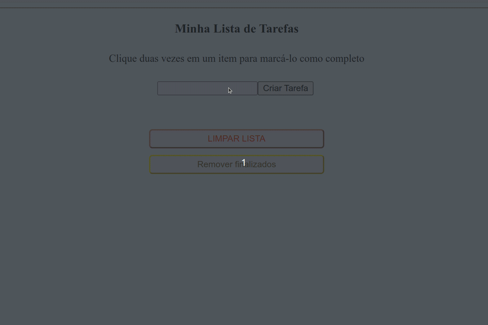

#  Project Todo List 




## 🌐 [](https://github.com/SamuelRocha91/TodoList/blob/main/README.md) [](https://github.com/SamuelRocha91/TodoList/blob/main/README_es.md) [](https://github.com/SamuelRocha91/TodoList/blob/main/README_en.md) [](https://github.com/SamuelRocha91/TodoList/blob/main/README_ru.md) [](https://github.com/SamuelRocha91/TodoList/blob/main/README_ch.md) [](https://github.com/SamuelRocha91/TodoList/blob/main/README_ar.md)


Este é um projeto bônus desenvolvido no módulo de **Fundamentos** do curso de **Desenvolvimento Web da Trybe**. O objetivo principal foi praticar e aplicar conceitos de **JavaScript**, **CSS** e **HTML** em um organizador de tarefas simples. O projeto envolveu a manipulação dos arquivos `script.js`, `index.html` e `style.css`.

## Funcionalidades
A aplicação permite:

- Adicionar tarefas à lista.
- Marcar uma tarefa como concluída com um **duplo clique**.
- Remover tarefas concluídas.
- Apagar todas as tarefas da lista.

## Competências Desenvolvidas

Durante o desenvolvimento deste projeto, foram aprimoradas as seguintes competências:

1. Manipulação de elementos no **DOM**.
2. Uso de **Web Storage** para armazenar dados no navegador.
3. **Lógica de programação** aplicada a um contexto real.
4. Utilização de **estruturas de repetição**.
5. Aplicação de **condicionais**.
6. Escrita e uso de **funções** para modularizar o código.

## Outros Projetos de Iniciante

Aqui estão outros projetos que desenvolvi durante o início da minha jornada como desenvolvedor:

- 🖥️ [Conversor de binários](https://github.com/SamuelRocha91/Bin2Dec)
- 🎨 [Pixels Art](https://github.com/SamuelRocha91/PixelsArt)
- 🧮 [Calculadora](https://github.com/SamuelRocha91/calculator)
- 🪐 [Star Wars Planets](https://github.com/SamuelRocha91/javascriptStarWarsPlanets)
- 🦖 [Meme generator](https://github.com/SamuelRocha91/memeGenerator)

## Como Executar

1. Clone este repositório:  
   ```bash
   git clone https://github.com/seu-usuario/project-todo-list.git
   ```
2. Navegue até o diretório do projeto:  
   ```bash
   cd project-todo-list
   ```
3. Abra o arquivo `index.html` no navegador.

